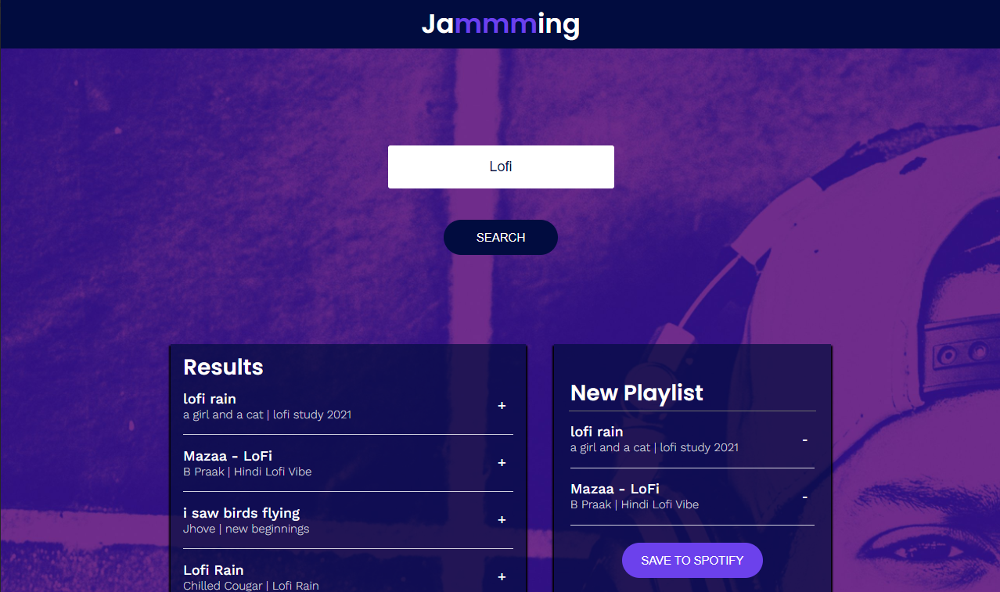

# Jammming

This is a React practice project which integrates with Spotify API. Users can search tracks and add them to a new playlist.

## Before Start

Because the project integrates with Spotify. You will need to register an account and create an application in Spotify Dashboard.

Steps:
1. Register Spotify account
2. Create an application in Spotify Dashboard
3. Add http://localhost:3000/ to its redirect URL
4. Paste the client ID of application to the src/util/Spotify.js
5. Done!

